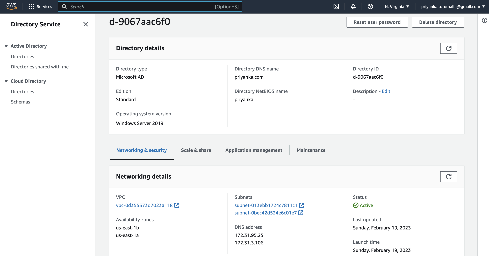
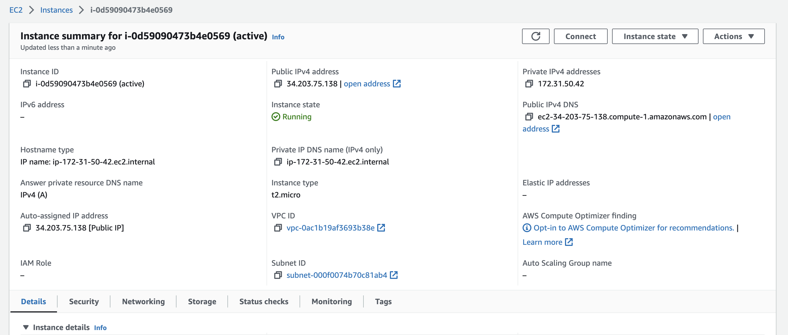
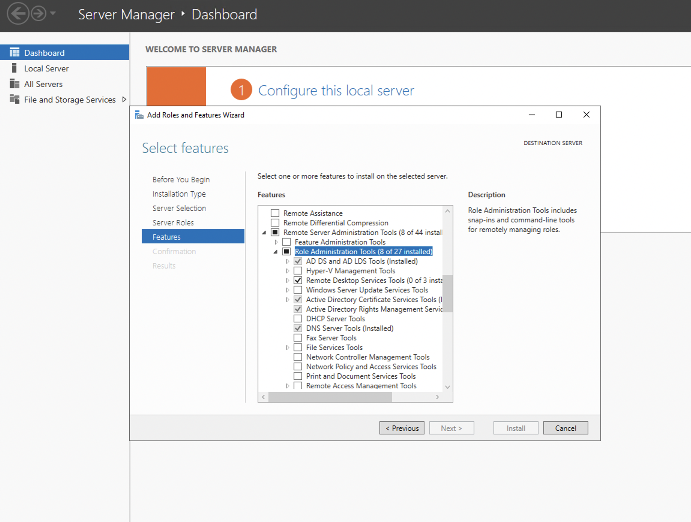
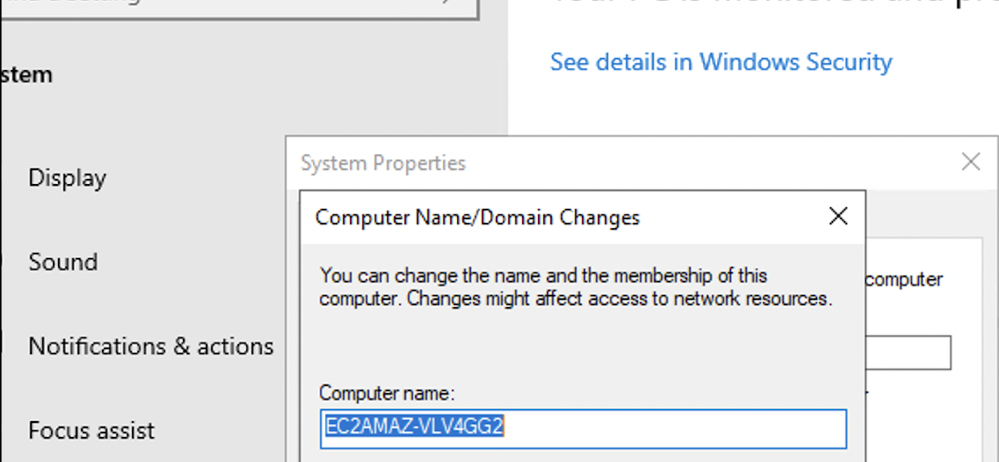
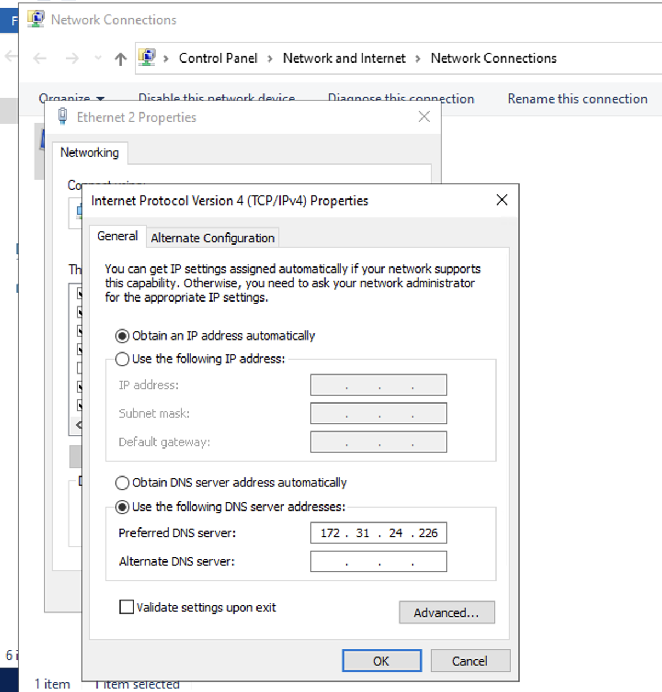
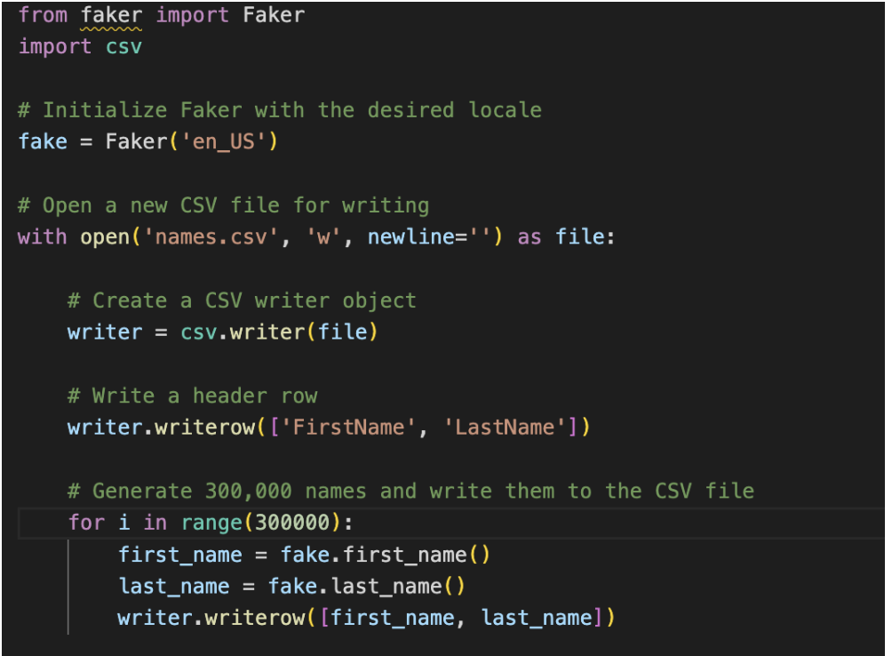
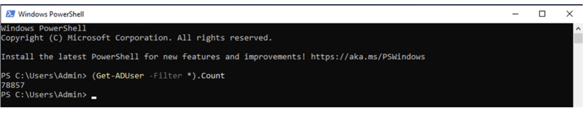

# ActiveDirectory_CMPE282

### Steps:

### Step 1: Set up AWS managed active directory on directory service.
```
•	Once after logging into the AWS account navigate to the AWS management console and go to workspaces and select “directories” as shown below and select “Microsoft AD” and click next:


 
 
### Step 2: Launch EC2 instance with microsoft Os image
 ```
- Connect to Microsoft EC2 Instance.
- Set DNS address of Directory Service created in AWS, inside Internet Protocol(TCP/IPv4) Properties.
- Set the Domain name of Directory Service
- Install all the active directory domain feature 
- Now we are connected to our created Active Directory 
 ```







 
### Step 3: Import Users in AD from large dataset
```
- Used Faker to Generate the Data for User Names
- Then use a PowerShell script to add the user data one at a time to Active Directory
```



### Step 4: Checking Number of User in the Active Directory



 
