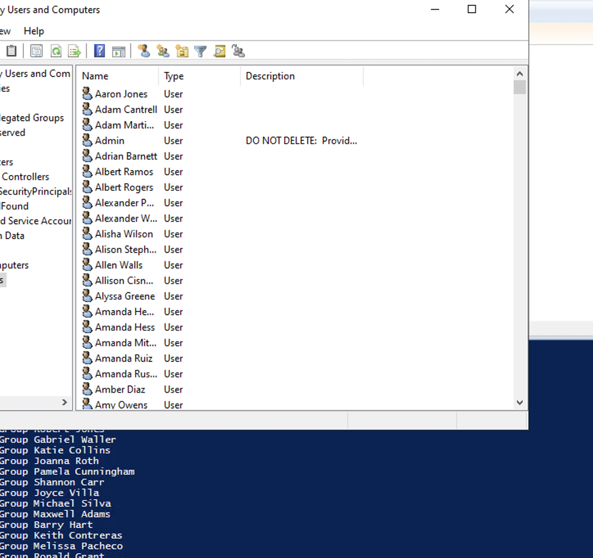

# cmpe282_homework1_active_directory

Create an AWS Directory Service AD in AWS and Populate with users from the sample user database having a large dataset of (300K+ users).

### Step 1: Set up AWS managed active directory on directory service.

•	Once after logging into the AWS account navigate to the AWS management console and go to workspaces and select “directories” as shown below and select “Microsoft AD” and click next:

 
 
•	Select the VPC and subnets in different availability zones as shown below:

 
 
 •	Once the directory is created and the status changes to active, it will be displayed as shown here:

 
 
 
### Step 2: 

•	Launch the EC2 instance and Select Microsoft Windows Server 2019 Base OS image, Set the DNS address of the Directory Service created in AWS, inside Internet Protocol(TCP/IPv4) Properties and also set the domain name of the directory.

•	Install all the active directory domain features on the instance for which open the Server Manager and then select “Role-based or feature-based installation” and click next, this provides a powerful set of tools for managing a windows server.

•	We can configure the DNS server in Windows Server using the Remote Server Administration Tools (RSAT) by using the DNS Manager tool.

•	Change the Domain Name by opening the server manager tool and click on the local server and then inside the system properties and click on the change button to rename the domain.

 
 
### Step 3: 

•	Used Faker to easily create large datasets of User Names.
•	To use the faker library to generate the data in Python, we have to install the faker library.
•	Create a Faker object and use its methods to generate various types of data, including user names. For example, you can generate a single user name by calling the "user_name()" method on the Faker object:

### Step 4: Checking Number of User in the Active Directory

